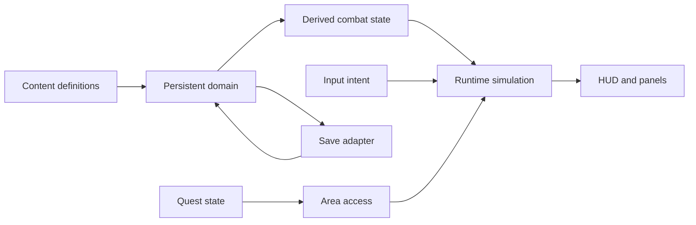

# Hellforge ARPG Vertical Slice Specification

> Status: **APPROVED DESIGN BASELINE**
>
> Date: 2026-07-16
>
> Product benchmark: `/Users/you/dev/aidiablo2.25- 2`
>
> Scope owner: `forgeax-games/hellforge`
>
> Where this specification conflicts with legacy camera, input, progression, or
> UI descriptions in `AGENTS.md`, `README.md`, or `PLAY_EXPERIENCE.md`, this
> specification controls the new vertical-slice work.

## 1. Product statement

Hellforge will become a **single-player, 15–20 minute, Sorceress-first Act-1
vertical slice**. Its loop, operation grammar, and UI information architecture
align with AIDiablo; its UI visual language is D2R-inspired. Hellforge retains
its original world, models, skills, environments, names, and visual identity.

The target loop is:

```text
Select Sorceress
  → enter Cinderwatch camp
  → talk to quest NPC
  → accept "Purge Slagdeep Hollow"
  → cross the wilderness while fighting, levelling, and looting
  → enter the unlocked dungeon
  → defeat the dungeon objective / boss
  → return to camp
  → turn in the quest
  → equip the guaranteed frost reward
  → spend skill points
  → exit and continue with progression restored
```

The slice is a product-quality proof of the complete game skeleton, not a
content-volume proof.

## 2. Benchmark contract

### 2.1 What Hellforge aligns with

- Safe camp → dangerous wilderness → gated dungeon → return-to-camp rhythm.
- Point-and-click movement, contextual interaction, target pursuit, and a
  selected right-click skill.
- A stable isometric combat view.
- D2R-inspired HUD hierarchy: health/mana globes, bottom skill bar, XP bar,
  minimap, quest tracker, inventory paper doll, skill tree, quest log, and
  character sheet.
- Progression that visibly connects skill points, equipment, combat numbers,
  quest rewards, and persistence.
- A short authored quest that gates access to a dungeon.

### 2.2 What Hellforge does not copy

- AIDiablo's authoritative multiplayer server, prediction, rooms, or protocol.
- Its giant `GameScene.ts`, `server/game.ts`, or monolithic configuration style.
- Diablo/AIDiablo story, names, numbers, textures, fonts, sounds, icons, or code.
- Eight-class or 30-node-per-class content volume in the first slice.
- Rune words, sockets, Horadric Cube, durability, multi-cell inventory,
  difficulty tiers, or endgame.

### 2.3 UI visual benchmark

Use **Diablo II: Resurrected as a visual-language benchmark**, not as an asset
source:

- dark stone and forged-iron frames;
- red and blue resource globes;
- gothic serif display typography paired with legible UI text;
- dark parchment / soot-black panel surfaces;
- gold interaction and selection highlights;
- Hellforge lava orange, ash, slag, and forge motifs as the proprietary skin.

No Blizzard assets, extracted sounds, icons, fonts, or textures may be used.

## 3. Confirmed product decisions

1. **Single-player only.** Networking is explicitly out of scope.
2. **Sorceress first.** Barbarian and Necromancer cards remain visible but are
   disabled and labelled “In development”; they cannot create playable saves.
3. **Default combat view:** fixed-direction isometric ARPG camera.
4. **Showcase view:** `V` toggles a smoothed third-person camera **only in the
   camp safe zone**. Showcase mode disables combat.
5. **No true first-person mode** in this slice.
6. **Default operation:** point-and-click movement and interaction.
7. **WASD remains optional:** any WASD input immediately takes ownership and
   cancels the current click-to-move target.
8. **Skill operation:** number keys 1–4 select the right-click skill; they do not
   cast immediately.
   LMB enemy pursuit casts the same learned Frost Fang used by the skill tree:
   it shares rank, equipment modifiers, mana, cooldown, pierce, and slow with
   RMB Frost Fang, but is independent of the currently selected RMB slot.
9. **Skill points only.** STR/DEX/VIT/ENERGY allocation is out of scope.
10. **Complete Sorceress tree:** three branches, 33 implemented nodes
    (11 per branch); no UI-only nodes.
11. **Inventory:** a 60 single-cell bag (12×5) and six equipment slots.
12. **Persistence:** save long-term progression; reload at camp with full
    health/mana.
13. **Death:** return to camp, retain long-term progression, reset the current
    combat run.
14. **Maps:** authored camp, hybrid wilderness, deterministic generated dungeon.
15. **Desktop landscape only:** 1920×1080 design baseline; 1280×720 minimum.
16. **Audio:** licensed real samples are primary; synthesized SFX remain fallback.

## 4. Experience budget

The first complete run targets 15–20 minutes:

- Camp introduction and quest acceptance: 2–3 minutes.
- Wilderness fighting, loot, and first upgrades: 4–5 minutes.
- Dungeon and boss: 7–9 minutes.
- Return, quest turn-in, equipment comparison, and skill allocation: 2–3 minutes.

Expected progression:

- reach approximately level 3–4;
- earn 2–3 spendable skill points;
- receive at least one clearly better random item;
- receive one guaranteed frost-oriented quest weapon;
- normal monsters take roughly 2–4 Frost Fang hits;
- the boss takes roughly 40–70 seconds.

These are initial tuning targets, not permanent balance constants.

## 5. Runtime ownership model

Hellforge currently distributes authoritative state across `main.ts`,
`PlayerStats`, equipment closures, `questDone`, and shallow `CharacterRecord`
storage. The slice replaces that ambiguity with one in-memory
`CharacterDomain` authority plus deep modules at explicit seams.



### 5.1 Persistent domain

`CharacterDomain` is the only mutable owner of identity, level, XP, gold,
inventory, equipment, skill ranks, hotbar, unspent points, and quest status.
Its fields are private. Callers can only dispatch domain commands and read an
immutable `CharacterSnapshot`. Combat derivation, UI view models, and the save
adapter consume snapshots; none keeps a writable mirror.

Runtime-only `PlayerRuntimeState` owns HP/MP, cooldowns, position, current
movement intent, spawned combat entities, and death flags. The save adapter is
serialization only; it is never a second gameplay store.

```ts
interface CharacterDomain {
  dispatch(command: CharacterCommand): CharacterResult;
  snapshot(): DeepReadonly<CharacterSnapshot>;
}

function hydrateCharacter(
  envelope: DeepReadonly<CharacterSaveEnvelope>,
): CharacterDomain;

function serializeCharacter(
  snapshot: DeepReadonly<CharacterSnapshot>,
): CharacterSaveEnvelope;
```

Loaded envelopes are validated, hydrated, and discarded. Save code receives a
snapshot and cannot mutate the live domain. `DeepReadonly<T>` is recursive over
objects, records, tuples, arrays, and item affix arrays. `snapshot()` returns a
detached deep-cloned value; development/test builds deep-freeze it. Mutating a
cast-away snapshot reference must never change the domain's next snapshot.

```ts
interface CharacterSaveEnvelope {
  readonly schemaVersion: 1;
  readonly character: {
    readonly id: string;
    readonly playerName: string;
    readonly classId: "sorceress";
    readonly createdAt: number;
    readonly lastPlayedAt: number;
  };
  readonly progression: {
    readonly level: number;
    readonly xp: number;
    readonly gold: number;
    readonly unspentSkillPoints: number;
    readonly skillRanks: Readonly<Record<SkillNodeId, number>>;
    readonly hotbar: readonly [
      ActiveSkillId | null,
      ActiveSkillId | null,
      ActiveSkillId | null,
      ActiveSkillId | null
    ];
    readonly selectedHotbarSlot: 0 | 1 | 2 | 3;
  };
  readonly inventory: {
    readonly bag: readonly (Readonly<ItemInstance> | null)[];
    readonly equipment: Readonly<Equipment>;
  };
  readonly quests: Readonly<Record<QuestId, QuestSave>>;
  readonly checkpointId: "cinderwatch";
}
```

Saved:

- identity and timestamps;
- level, XP, gold;
- unspent points, skill ranks, and hotbar;
- rolled item instances, bag slots, and equipment;
- quest status (area access is derived from it);
- stable checkpoint identifier.

Not saved:

- exact world position;
- current HP/MP;
- cooldowns, projectiles, monsters, or boss health;
- camera mode;
- open UI panels.

Reload always spawns at Cinderwatch with full HP/MP.

Storage and migration:

- legacy list remains read-only at `hellforge.characters.v1`;
- the new store uses `hellforge.character-saves.v1`;
- only legacy Sorceress records migrate;
- legacy Barbarian/Necromancer records remain visible but disabled and labelled
  “In development”;
- migration is atomic and idempotent: write and validate the new envelope before
  treating it as migrated, and never delete the legacy record;
- new characters start with Frost Fang rank 1, hotbar
  `[frost, null, null, null]`, and selected slot 0.

### 5.2 Derived combat state

`CombatStats` is derived, never persisted:

```ts
interface CombatStats {
  maxHp: number;
  maxMana: number;
  hpRegen: number;
  manaRegen: number;
  moveSpeed: number;
  damageReduction: number;
  globalDamageMul: number;
  fireDamageMul: number;
  frostDamageMul: number;
  arcDamageMul: number;
  critChance: number;
  critMultiplier: number;
  cooldownMul: number;
  goldFind: number;
  magicFind: number;
  xpGain: number;
  lifeOnKill: number;
}
```

Inputs are class definition, level growth, skill ranks, and equipment. All
incoming damage goes through one resolver; all skill output goes through one
skill resolver. Re-deriving maximum HP/MP preserves the current percentage so
equipment cannot be repeatedly equipped to heal.

Fields with no consumer, such as base weapon attack speed while the game has no
weapon attack, must not appear as false product capabilities.

Initial shared formulas:

- base crit comes only from class data: 5% chance and 1.5× multiplier before
  equipment/tree modifiers;
- `damageReduction = clamp(defense / (defense + 100 + 15 × (level - 1)), 0, 0.60)`;
- cooldown reduction caps at 45%;
- equipment move-speed bonus caps at 40%;
- final crit chance caps at 50%;
- max-resource changes preserve `current / previousMax`, clamped to `[0, 1]`.

Initial active-skill base data:

| Skill | Damage | Mana | Cooldown | Projectile | Range/lifetime | Status |
|---|---:|---:|---:|---|---|---|
| Magma Bolt | 16 direct | 6 | 0.45 s | 1 at 15 m/s | 1.5 s | 1.7 m splash at 50% direct damage |
| Frost Fang | 11 | 7 | 0.60 s | 1 at 19 m/s | 1.2 s | 35% slow for 2.2 s; no base pierce |
| Arc Surge | 8 per bolt | 9 | 0.80 s | 3 at 10 m/s | 1.6 s | erratic flight |
| Phase Step | — | 12 | 3.0 s | — | 6.5 m | walkability-gated teleport |

These values are consumed only through `SkillResolver`; `SkillSystem` may not
retain separate crit/base-skill constants.

### 5.3 Input intent

Click movement and WASD share one interface:

```ts
type InteractionRef =
  | { kind: "monster"; id: string }
  | { kind: "npc"; id: NpcId }
  | { kind: "loot"; id: string }
  | { kind: "exit"; id: AreaExitId };

type MovementIntent =
  | { kind: "none" }
  | { kind: "point"; world: readonly [number, number] }
  | { kind: "target"; target: InteractionRef }
  | { kind: "vector"; x: number; z: number };

interface InteractionRegistry {
  resolve(ref: InteractionRef): {
    position: readonly [number, number];
    interactionRange: number;
    valid: boolean;
    execute: () => InteractionResult;
  } | null;
}
```

Rules:

- LMB ground → path to point.
- LMB NPC/loot/entrance → path to interaction range, then act.
- LMB enemy → pursue, then cast the primary Frost Fang when in range.
- RMB → cast the selected hotbar skill toward the cursor.
- 1–4 → select a learned active skill from the saved hotbar.
- Any WASD press → replace point/target intent with vector intent.
- Opening a major panel or dialogue → clear intent and block world input.

The dungeon requires grid pathfinding rather than AIDiablo's straight-line
target steering. Cinderwatch uses
`assets/scenes/rogue-encampment.obstacles.json`; Ashen Reach uses
`assets/scenes/ashen-reach.layout.json`. Both are authored in M1 and feed the
same navigation query. Stable interaction references prevent ECS handle reuse
from redirecting an old click target.

### 5.4 Area contract

```ts
interface AreaDef {
  id: AreaId;
  kind: "hub" | "wilderness" | "dungeon";
  source: AuthoredSceneSource | GeneratedAreaSource;
  entryPoints: Record<string, AreaEntryPoint>;
  exits: AreaExitDef[];
  requiredQuestStates: QuestRequirement[];
  encounters: EncounterTableId | null;
  environment: EnvironmentProfileId;
  navigation: NavigationSource;
  music: MusicProfileId;
}
```

Long-term strategy:

- Cinderwatch: authored hub.
- Ashen Reach: one authored traversable route plus two authored landmarks
  (`slag-bridge`, `fallen-forge`), authored navigation blockers, and seeded
  encounter/decor markers. Every random choice consumes an injected area seed,
  never ambient `Math.random()`.
- Slagdeep Hollow: deterministic seeded dungeon.

Generators output the same area data as authored content: scene entities,
navigation, player/camera collision proxies, entries/exits, encounter markers,
environment profile, and audio profile. Quest logic references `AreaId`, never
hard-coded coordinates or the current `(300, 300)` implementation detail.

Area streaming is deferred until the number of areas justifies it. The first
slice may retain one-world teleporting behind the `AreaDef` interface.

Slagdeep access is derived, not separately saved: quest status
`active | ready | completed` allows entry; `available` denies it. The quest has
two concrete run objectives: `den-minions-cleared` and
`slagdeep-boss-defeated`. Both must be true in the same active combat run before
the quest becomes `ready`.

## 6. Camera and navigation

### 6.1 Isometric combat camera

- Mode: `arpg`.
- Fixed yaw; no free combat-camera rotation.
- Initial browser-tuning candidates:
  - vertical FOV: 48°, 50°, 55° (converted to radians at the engine interface);
  - distance: 10–14 m, starting at 12 m;
  - pitch: 50–55° downward;
  - yaw: 30°, 37.5°, 45°.
- Mouse wheel adjusts distance within a bounded range; it does not change pitch.
- Follow uses frame-rate-independent exponential damping.
- Camera projection, `worldToScreen`, picking, and aim unprojection consume the
  same camera state; no duplicate FOV constants.
- Screen shake uses a decaying, low-frequency/directional impulse rather than a
  new full-amplitude random offset every frame.

Final yaw/FOV is selected by browser A/B in camp, wilderness, and dungeon; the
reference project's 15° FOV is not copied mechanically because world scale
differs.

### 6.2 Third-person showcase camera

- Mode: `showcase`.
- Available only in Cinderwatch safe zone.
- `V` transitions between modes over 350–500 ms.
- Entering clears movement target, pursuit, and pending casts.
- WASD walks; RMB drag or explicit pointer input orbits.
- Skills, enemy targeting, loot combat actions, and dungeon entry are disabled.
- Combat HUD is hidden or visually reduced.
- Initial FOV: 55–60°.
- Arm length: 2.4–2.8 m.
- A spring-arm probe shortens the arm before obstacles and restores it smoothly.
- Camera collision ignores player, loot, triggers, and VFX.
- Leaving camp or entering combat forces `arpg`.

Scene collision proxies are a prerequisite. Smoothing alone is not accepted as
a wall-clipping fix.

## 7. Sorceress skill tree

### 7.1 System behaviour

The tree contains three tabs and 33 implemented nodes (11 per branch:
9 normal + 2 keystones / `capstone` kind):

- Flame;
- Frost;
- Arcane.

Required behaviour:

- `locked`, `available`, `invested`, and `maxed` visual states;
- rank and maximum rank;
- level gates and prerequisite edges;
- remaining-point display;
- current-rank and next-rank tooltip values;
- active-skill assignment to one of four hotbar slots;
- free respec in Cinderwatch for the first slice;
- skill ranks, hotbar, and unspent points persist;
- every node changes runtime behaviour or numbers through `SkillResolver`.

Frost Fang and Magma Bolt start at rank 1 without consuming a point. Each level
after level 1 grants one point. Respec never removes or refunds those free
starter ranks; it refunds only paid ranks. Any hotbar slot whose active skill
becomes unlearned is cleared, and selection falls back to the valid Frost Fang
slot. Save schema version stays 1 — missing new-node ranks hydrate as 0.

### 7.2 33-node content

Values below are initial implementation values and must remain data-driven.

#### Flame

1. **Magma Bolt** — active, max 5; each rank above 1 adds 12% base damage.
2. **Kindling** — passive, max 3, requires Magma Bolt 2; +6% fire damage/rank.
3. **Scorch** — modifier, max 3, requires Magma Bolt 2; adds 20/30/40% hit
   damage over 2 seconds.
4. **Volatile Core** — modifier, max 2, requires Kindling 2 or Scorch 2;
   +0.35 m splash radius and +10% splash damage/rank.
5. **Hellfire Catalyst** — capstone, max 1, requires Volatile Core 2 and level 6;
   Magma Bolt critical hits trigger an extra 50% damage explosion.
6. **Flame Burst** — active, max 5, requires Magma Bolt 3 and level 4; instant
   PBAOE at caster; each rank above 1 adds 10% base damage.
7. **Ember** — passive, max 3, requires Scorch 2; Scorch duration +0.5 s/rank.
8. **Searing** — passive, max 3, requires Kindling 2; +5% crit chance/rank vs
   burning targets.
9. **Wildfire** — modifier, max 2, requires Volatile Core 2 and level 4; splash
   applies Scorch at 50/100% fraction.
10. **Heat Shimmer** — passive, max 2, requires Volatile Core 1; Magma projectile
    speed +15%/rank.
11. **Furnace Heart** — capstone, max 1, requires Hellfire Catalyst 1 and level 6;
    killing a burning enemy detonates it (50% of killing hit, 2 m, no recursion).

Resolver details:

- Magma rank multiplier is `1 + 0.12 × (rank - 1)`.
- Kindling multiplies all fire damage by `1 + 0.06 × rank`.
- Scorch has one stack per target. A new hit refreshes base 2 seconds (+ Ember)
  and replaces the stored amount; it does not stack. Total DoT is hit damage ×
  `0.20 | 0.30 | 0.40`.
- Base splash deals 50% of direct damage in 1.7 m. Volatile Core changes radius
  to `1.7 + 0.35 × rank` m and splash ratio to `0.50 + 0.10 × rank`.
- Hellfire Catalyst adds one 1.5 m explosion dealing 50% of the critical direct
  hit to secondary targets only. It cannot recursively trigger Scorch,
  Catalyst, or Shatter.
- Flame Burst rank multiplier is `1 + 0.10 × (rank - 1)`.
- Wildfire splash-scorch fractions are `0.50 | 1.00`.
- Furnace Heart detonation cannot recursively trigger Scorch, Catalyst, Shatter,
  or itself.

#### Frost

1. **Frost Fang** — starter active, max 5; each rank above 1 adds 10% base damage.
2. **Permafrost** — passive, max 3, requires Frost Fang 2; +0.4 s slow
   duration/rank.
3. **Piercing Ice** — modifier, max 1, requires Frost Fang 2; +1 target pierce.
4. **Shatter** — modifier, max 3, requires Permafrost 2 or Piercing Ice; impact
   emits 2/3/4 shards at 15% hit damage each.
5. **Winter's Grasp** — capstone, max 1, requires Shatter 3 and level 6;
   +30% Frost Fang damage against slowed targets.
6. **Frost Nova** — active, max 5, requires Frost Fang 3 and level 4; instant
   PBAOE ring with damage + slow; each rank above 1 adds 10% base damage.
7. **Rime** — passive, max 3, requires Permafrost 2; slow magnitude +5%/rank.
8. **Piercing Cold** — modifier, max 1, requires Piercing Ice and level 4;
   pierce +1 (total 2 with Piercing Ice).
9. **Glacier Shards** — modifier, max 2, requires Shatter 3 and level 4;
   Shatter shard count +1/rank.
10. **Frozen Focus** — passive, max 3, requires Frost Fang 3; Frost mana cost
    −0.5/rank.
11. **Deep Freeze** — capstone, max 1, requires Winter's Grasp 1 and level 6;
    hits on already-slowed targets +15% and refresh slow (+0.5 s).

Resolver details:

- Frost rank multiplier is `1 + 0.10 × (rank - 1)`.
- Base slow is 35% for 2.2 seconds; Permafrost adds 0.4 seconds/rank and refreshes
  duration without stacking magnitude. Rime adds +5% magnitude/rank.
- Piercing Ice changes pierce count from 0 to 1; Piercing Cold adds one more.
- Every successful direct Frost Fang hit, including the pierced hit, can emit
  Shatter once. It sends `2/3/4 + Glacier Shards` shards to the nearest distinct
  monsters within 3 m. Each shard deals 15% of that direct hit; shards cannot
  hit the source target and cannot recursively trigger skill effects.
- Winter's Grasp checks the target's slow status before damage resolution and
  applies a 1.30 multiplier.
- Frost Nova rank multiplier is `1 + 0.10 × (rank - 1)` and reuses frost slow
  folds.
- Deep Freeze multiplies already-slowed hits by 1.15 and refreshes slow by 0.5 s.

#### Arcane

1. **Arc Surge** — active, max 5; each rank above 1 adds 10% base damage.
2. **Conduction** — modifier, max 3, requires Arc Surge 2; adds one arc bolt per
   rank while scaling each added bolt to avoid multiplying total damage unchecked.
3. **Phase Step** — active, max 1, requires Arc Surge 2; unlocks Blink.
4. **Phase Echo** — passive, max 3, requires Phase Step; the next damaging skill
   within 2 seconds after Blink gains +10% damage/rank.
5. **Overcharge** — capstone, max 1, requires Conduction 3 and Phase Echo 2;
   Arc Surge hits reduce Blink cooldown by 0.25 s, capped at 1 s per cast.
6. **Discharge** — active, max 5, requires Arc Surge 3 and level 4; radial bolt
   burst (`6 + rank` bolts, conduction-style per-bolt scale); each rank above 1
   adds 10% base damage.
7. **Resonance** — passive, max 3, requires Arc Surge 3; +6% arc damage/rank.
8. **Swift Phases** — passive, max 2, requires Phase Step; Blink cooldown
   −0.5 s/rank.
9. **Echo Mastery** — modifier, max 2, requires Phase Echo 2 and level 4;
   Phase Echo window +0.5 s and +5% damage/rank.
10. **Overcast** — passive, max 2, requires Conduction 1; Arc cooldown
    −8%/rank.
11. **Tempest Conduit** — capstone, max 1, requires Overcharge 1 and level 6;
    Overcharge cap 1 s → 2 s and also applies to Discharge's cooldown.

Resolver details:

- Arc rank multiplier is `1 + 0.10 × (rank - 1)`.
- Conduction bolt count is `3 + rank`. Per-bolt multiplier is
  `(3 / (3 + rank)) × (1 + 0.08 × rank)`, so each rank adds 8% total theoretical
  damage rather than multiplying the original three-bolt damage unchecked.
- A successful Phase Step grants one Phase Echo charge (base 2 s; Echo Mastery
  extends). The next successful damaging cast consumes it and multiplies that
  entire cast by `1 + 0.10 × rank` (+ Echo Mastery damage); expiry consumes it
  without effect.
- Each Arc Surge projectile's first valid hit may reduce Phase Step cooldown by
  0.25 seconds. Reduction is capped at 1 second for that cast (2 s with Tempest
  Conduit). Tempest Conduit also applies the same CDR path to Discharge.
- Discharge bolt count is `6 + rank` with conduction-style per-bolt scaling.
- Resonance multiplies arc damage by `1 + 0.06 × rank`.
- Overcast multiplies Arc cooldown by `1 − 0.08 × rank`.

The first 15–20 minute run exposes only early nodes; later content uses the same
tree without redesign. The DEV skill fixture (`?hfSkillFixture=1`) can apply a
fully invested Flame branch for stills and video.

## 8. Equipment and inventory

Existing item generation, rarity, affixes, 60 bag slots, and six equipment
slots remain:

- weapon;
- helm;
- armor;
- boots;
- ring;
- amulet.

The UI is rebuilt as a D2R-inspired paper doll plus single-cell bag:

- clear slot silhouettes and compatibility;
- rarity colour and item level;
- full affix tooltip;
- equipped-vs-hovered stat comparison;
- click or drag equip/unequip;
- melt action with confirmation;
- explicit full-bag feedback;
- stable `ItemInstance.instanceId`;
- save the rolled item, not a recipe that re-rolls on load.

The quest reward is a deterministic recipe, not a partially shaped `Item`:

```ts
const FROSTFORGED_WAND_REWARD: QuestRewardDef = {
  contentId: "quest-frostforged-wand",
  name: "霜铸魔杖",
  slot: "weapon",
  rarity: "rare",
  ilvl: 4,
  reqLevel: 1,
  affixes: [
    { stat: "frostDmg", v: 0.20 },
    { stat: "cdr", v: 0.08 }
  ]
};
```

`createFrostforgedWand()` generates a fresh `instanceId`, canonical affix labels,
and score from this recipe. The reward must produce a visible tooltip comparison
and measurable Frost Fang change.

## 9. Quest and dialogue

The existing automatic `questDone` boolean becomes a formal quest:

- ID: `purge-slagdeep-hollow`;
- title: `清剿熔渣深窟`;
- giver/turn-in NPC: `npc-cinderwarden-veyra` (`烬守者维拉`);
- states: `available → active → ready → completed`.

Flow:

1. Click Veyra in camp.
2. Linear dialogue explains the Hollow threat.
3. Accepting the quest unlocks the dungeon entrance.
4. The player clears the dungeon objective and boss.
5. State becomes `ready`; rewards are not granted automatically.
6. The player returns to camp and speaks to Veyra.
7. Turn-in grants 120 XP, 250 gold, and `霜铸魔杖`.

Dialogue reads quest state and emits commands. It does not mutate rewards or
area access directly. Quest logic owns state transitions, objective progress,
rewards, and gates.

Turn-in is transactional. If the 60-slot bag is full, dialogue returns
`inventory-full`, grants nothing, and leaves the quest `ready/unclaimed`.
Only successful insertion of all rewards may transition to `completed`; that
transition and save happen once.

Quest state autosaves at acceptance, readiness, and completion. Active-run
objective flags are transient: reloading or dying while `active` starts the
same seeded combat run from zero. The seed is reproducibly derived with a fixed
32-bit FNV-1a hash of
`characterId + "|" + questId + "|" + areaId`; it is not another saved field.
Once both objectives make the quest `ready`, that status persists.

`CombatRunDomain` privately owns area, derived seed, and transient objective
flags. It exposes commands plus a deep-readonly snapshot. Death/reload dispatches
`reset`; the reset orchestration then clears monster/boss state, enemy attacks,
player projectiles/cooldowns, ground loot, and transient VFX before rebuilding
encounters from the derived seed and returning the player to Cinderwatch.

Veyra's fixed first-slice asset contract:

- authored anchor name: `NpcVeyraAnchor`;
- initial anchor position: `[3.2, 0, 2.0]`, adjusted only if browser evidence
  shows overlap;
- visual source: `assets/characters/witch.glb`;
- scene GUID: `5e3028dd-ddf6-4104-86d9-318d3e8fb5a6`;
- idle clip GUID: `c530adf2-8de6-486a-afaa-9af3a6e6dfd1`;
- scale: `1.15`;
- initial yaw: `π`;
- interaction radius: `2.2 m`.

The anchor belongs in the camp pack; runtime instantiates the skinned visual and
idle animation at that authored anchor. Failure to resolve this real asset is a
hard M4 blocker, not permission to substitute a primitive.

## 10. VFX and audio quality slice

### 10.1 Frost Fang VFX

Shader work applies to the material/effect layer, not projectile gameplay.
Frost Fang is the quality prototype because Magma Bolt and the portal already
prove the WGSL pipeline.

Required layers:

1. cast/readability cue at the character;
2. crystal core and moving trail;
3. impact at the actual collision point;
4. persistent slow-state indicator whose lifetime matches gameplay;
5. Shatter node shards when learned.

Acceptance:

- readable in warm camp and dark dungeon;
- no ACES washout;
- repeated overlap does not become a white screen;
- projectile and impact positions match collision;
- slow visual begins/ends with status;
- high-frequency casting returns entity/instance counts to baseline;
- Edit mode retains the existing safe material fallback.

### 10.2 Audio

Real licensed OGG samples are primary. One mixer installed from `ctx.uiRoot`
owns autoplay unlock and Master/BGM/SFX buses.

Mandatory sample groups:

- Magma/Frost/Arc/Phase Step cast: at least 2 variants each;
- generic monster hit: 3 variants;
- critical hit: 2 variants;
- monster kill: 2 variants;
- loot pickup and equipment: 2 variants each;
- quest accept/complete: 1 each;
- UI confirm/cancel: 1 each;
- walk and run footsteps: 4 variants each.
- boss kill, player death, potion, level-up, and portal: 1 each;
- player hurt: 2 variants.

Optional projectile whooshes and ambient sweeteners may use synthesized fallback
when absent. Missing mandatory samples block M5; they may not silently fall
back. Existing camp/dungeon BGM and transitions remain.

Machine-readable `assets/audio/provenance.json` has two maps:

```ts
interface AudioManifest {
  events: Record<SfxEvent, {
    classification: "mandatory" | "optional-synthesis" | "remove";
    samples: string[];
  }>;
  music: Record<"camp" | "den", {
    samples: string[];
  }>;
  assets: Record<string, {
    sha256: string;
    source: string;
    license: string;
    attribution: string;
  }>;
}
```

Every current `SfxEvent` appears exactly once in `events`. Mandatory events
reference one or more sample paths; optional-synthesis/remove events may have no
file. The two music profiles reference their existing BGM paths. Every referenced
SFX/BGM appears in `assets`.
`assets/audio/LICENSES.md` is generated for human review and is not the SSOT.

## 11. UI information architecture

### 11.1 Persistent HUD

- bottom-left health globe;
- bottom-right mana globe;
- bottom-centre four-slot skill bar and current RMB skill;
- bottom XP bar;
- top-right automap and quest tracker;
- current monster name, level, and health near the target.

### 11.2 Major panels

- `I`: inventory + equipment paper doll;
- `K`: three-branch skill tree;
- `Q`: quest log;
- `C`: character/combat-stat sheet;
- dialogue: dedicated lower-screen layer.

Only one major panel or dialogue may own interaction at a time. Opening one:

- clears movement/target intent;
- blocks world input;
- exposes pointer interaction only on descendants of the game-owned UI root;
- does not mutate host-owned `ctx.uiRoot` styles.

At 1280×720, panels scroll internally rather than shrinking text and controls
below legibility.

## 12. Death and reset

On death:

- show a short death summary;
- return to Cinderwatch;
- restore full HP/MP;
- retain save-domain progression;
- clear monsters, enemy attacks, player projectiles, transient VFX, and ground
  loot from the failed combat run;
- reset active-run objective counters;
- respawn wilderness/dungeon encounters and the boss from the same area seed;
- preserve an already-earned persistent `ready` quest status;
- do not drop items, gold, durability, or a corpse.

Death saves no transient combat state.

## 13. Milestone acceptance

The final slice is delivered through six independently browser-acceptable
milestones:

1. **Camera, navigation, operation, and run animation**
2. **Versioned save, combat derivation, equipment UI**
3. **Complete Sorceress skill tree**
4. **NPC dialogue, quest state, and area gates**
5. **Frost Fang VFX and production SFX**
6. **Camp showcase camera and end-to-end acceptance**

No milestone may be marked complete by static code inspection alone. Each ends
with a browser walkthrough on both 1920×1080 and 1280×720.

## 14. Risks and controls

### Missing navigation/camera collision data

Current visual walls are not a queryable navigation/camera representation.
Author one obstacle source that can feed navigation and camera probes. Do not
claim spring-arm completion from smoothing alone.

### Duplicate state

`CharacterRecord`, `PlayerStats`, closure equipment, and `questDone` must not
remain parallel authorities. Migration must replace old ownership rather than
layering another store on top.

### Dual control systems

Point-and-click and WASD must emit one `MovementIntent`; two movement
implementations are not accepted.

### Two games hidden behind two cameras

Third-person combat is explicitly forbidden. If requested later, it requires a
separate design for aiming, targeting, telegraphs, UI, and balance.

### UI-only “complete” systems

Every skill node, equipment comparison, task state, and panel action must cross
into gameplay and persistence. A populated screen without runtime effects does
not satisfy this specification.

### Copyright / provenance

D2R is a layout and visual-language benchmark only. All shipped assets must be
original, team-owned, or appropriately licensed.

## 15. Completion definition

The vertical slice is complete only when a fresh user can:

1. create a Sorceress;
2. accept the quest through dialogue;
3. navigate by click while retaining WASD takeover;
4. fight with selected RMB skills;
5. level and invest skill points in a functioning three-branch tree;
6. compare and equip loot;
7. clear the gated dungeon and return for a reward;
8. observe Frost Fang's complete VFX/audio language;
9. use non-combat camp showcase mode without clipping;
10. close and reopen the game with long-term progression restored;
11. die and return to camp without corrupting progression;
12. complete the flow at both supported desktop resolutions.
